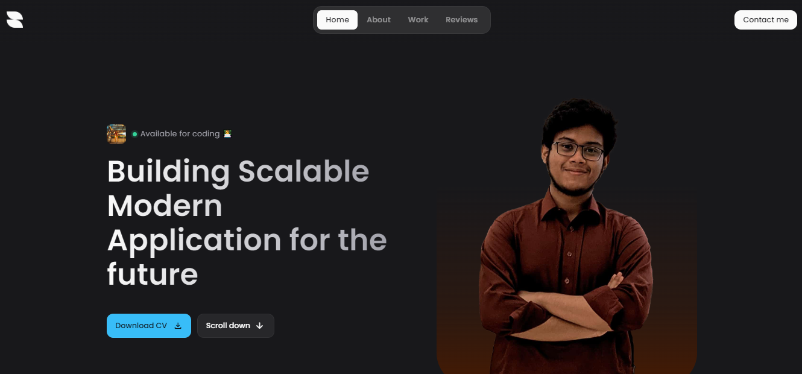

# My Portfolio

This my personal portfolio, where i share all my valuable information and project showcase




[](https://my-portfolio-simpleproject.vercel.app/)
## Technology

List of latest technology i used this project

_1. Framework_

[](https://react.dev/learn)
[](https://vite.dev/guide/)
[](https://tailwindcss.com/docs/guides/vite)

_2. JavaScript Library_

[](https://docs.getform.io/)
[](https://github.com/darkroomengineering/lenis)
[](https://gsap.com/docs/v3/Installation)
[](https://michalsnik.github.io/aos/)

_3. CDN_

[](https://fonts.google.com/share)
[
](https://fonts.google.com/icons)


## Installation

Install my-project with npm

```bash
npm inistall
```

Run this project on http://localhost:5173/
```bash
npm run dev
```
    
## Authors

- [@saad](https://www.github.com/istiakAHMEDsaad)

